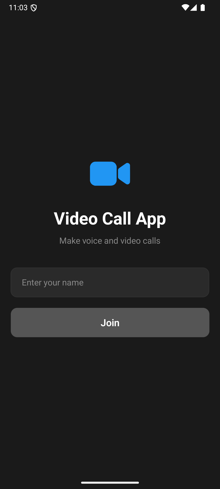
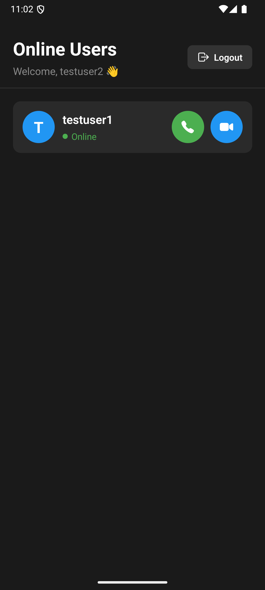
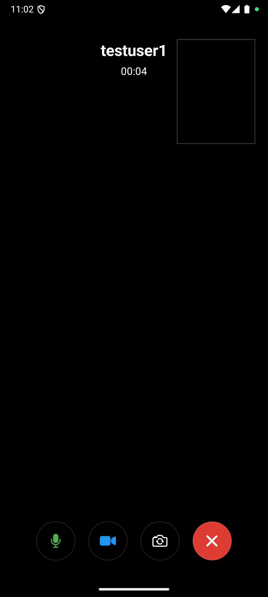
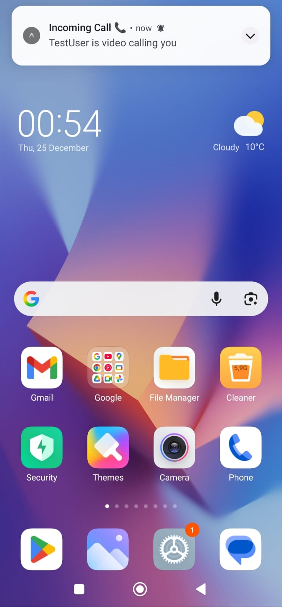

# 📞 Real-Time Video Call App

A modern, peer-to-peer video and audio calling application built with React Native and WebRTC. This application enables users to connect with each other instantly through high-quality video and audio calls, providing a seamless real-time communication experience similar to popular platforms like WhatsApp and FaceTime.

The app leverages cutting-edge WebRTC technology to establish direct peer-to-peer connections between devices, ensuring low latency and high-quality audio/video transmission. Unlike traditional calling solutions that route media through central servers, our implementation creates direct connections between users, resulting in faster call setup times and superior call quality. The application automatically handles complex networking scenarios using STUN/TURN servers, making it work reliably even behind firewalls and NAT configurations.

Built with a mobile-first approach, the application provides an intuitive user interface where users can see who's online in real-time and initiate calls with just a tap. The lobby screen displays all currently active users, allowing for instant connection without the need for scheduling or prior arrangement. Users can choose between audio-only calls for quick conversations or full video calls for face-to-face communication. The in-call experience includes essential controls like mute, camera toggle, and camera switching, giving users full control over their communication experience.

Push notifications ensure that users never miss a call, even when the app is running in the background or closed. When someone initiates a call, recipients receive an instant notification with the caller's information, allowing them to accept or reject the call. The entire system is built on a robust real-time infrastructure using Socket.IO for signaling, ensuring reliable message delivery and instant state synchronization across all connected devices.

## ✨ Features

- **🎥 HD Video Calls** - Crystal clear peer-to-peer video communication
- **🎤 Audio Calls** - High-quality voice calling option
- **👥 Online Users List** - See who's available in real-time
- **🔔 Push Notifications** - Get notified when someone calls you
- **📱 Mobile First** - Optimized for Android and iOS devices
- **🔒 Secure Connection** - Direct peer-to-peer encrypted communication
- **⚡ Real-Time** - Instant connection with Socket.IO signaling
- **🎛️ Call Controls** - Mute, camera toggle, and switch camera options

## 📱 Screenshots

<p align="center">
  
  
  
  
</p>

## 🚀 Getting Started

### Prerequisites

- Node.js (v16 or higher)
- npm or yarn
- Android Studio (for Android)
- Xcode (for iOS)
- Expo CLI
- Firebase account (for push notifications)

### Installation

#### Backend Setup

1. Navigate to backend folder:
```bash
cd backend
```

2. Install dependencies:
```bash
npm install
```

3. Create `.env` file (see `.env.example`):
```bash
PORT=3000
NODE_ENV=development
```

4. Start the server:
```bash
npm run dev
```

The server will run on `http://localhost:3000`

#### Mobile App Setup

1. Navigate to mobile folder:
```bash
cd mobile
```

2. Install dependencies:
```bash
npm install
```

3. Create `.env` file (see `.env.example`):
```bash
EXPO_PUBLIC_SOCKET_URL=http://YOUR_LOCAL_IP:3000
EXPO_PUBLIC_EAS_PROJECT_ID=your-eas-project-id
EXPO_PUBLIC_EAS_OWNER=your-expo-username
```

4. Add Firebase configuration:
   - Create a Firebase project at [Firebase Console](https://console.firebase.google.com)
   - Download `google-services.json` (Android)
   - Place it in the `mobile/` root directory

5. Build native code:
```bash
npx expo prebuild --clean
```

6. Run on Android:
```bash
npx expo run:android
```

Or run on iOS:
```bash
npx expo run:ios
```

## 🛠️ Technologies Used

### Frontend (Mobile)
- **React Native** - Cross-platform mobile framework
- **Expo** - Development platform
- **TypeScript** - Type-safe JavaScript
- **react-native-webrtc** - WebRTC implementation
- **Socket.IO Client** - Real-time communication
- **Zustand** - State management
- **Expo Notifications** - Push notifications

### Backend
- **Node.js** - JavaScript runtime
- **Express** - Web framework
- **Socket.IO** - Real-time bidirectional communication
- **TypeScript** - Type-safe JavaScript
- **expo-server-sdk** - Push notification server

### Infrastructure
- **WebRTC** - Peer-to-peer communication
- **Firebase Cloud Messaging** - Push notifications
- **STUN/TURN Servers** - NAT traversal

## 📖 How It Works

1. **Login** - Enter your username to join the lobby
2. **Lobby** - View all online users in real-time
3. **Call** - Tap audio 🎤 or video 📹 button to start a call
4. **Notification** - Recipient receives a push notification
5. **Connect** - WebRTC establishes a direct peer-to-peer connection
6. **Communicate** - Enjoy high-quality audio/video chat
7. **Controls** - Use in-call controls (mute, camera, end call)

## 🔒 Environment Variables

### Mobile App

Create a `.env` file in the `mobile/` directory:
```bash
EXPO_PUBLIC_SOCKET_URL=http://YOUR_IP:3000
EXPO_PUBLIC_EAS_PROJECT_ID=your-eas-project-id
EXPO_PUBLIC_EAS_OWNER=your-expo-username
```

### Backend

Create a `.env` file in the `backend/` directory:
```bash
PORT=3000
NODE_ENV=development
```

## 🤝 Contributing

Contributions are welcome! Please feel free to submit a Pull Request.

## 📄 License

This project is open source and available under the [MIT License](LICENSE).

## 👨‍💻 Author

**Mustafa Mutlu**
- GitHub: [@mmutlucod](https://github.com/mmutlucod)

## 🙏 Acknowledgments

- WebRTC for enabling peer-to-peer communication
- Expo team for the amazing development platform
- Socket.IO for real-time signaling
- Firebase for push notifications 
